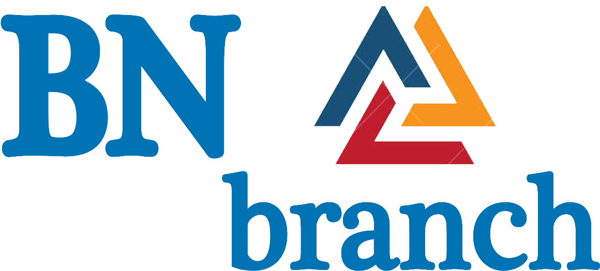
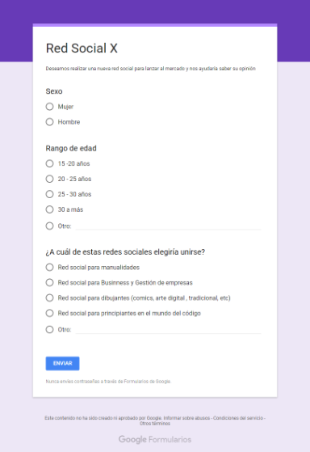
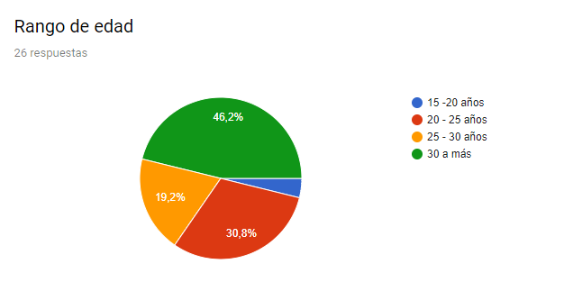
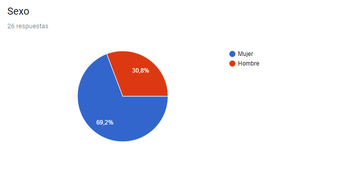
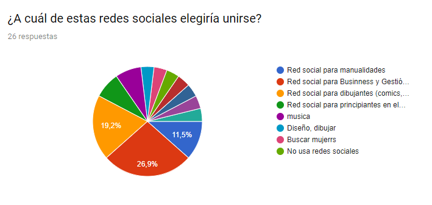

# BN branch

## RED SOCIAL DE BUSINESS

Esta plataforma está orientado hacia los negocios. BN branch es la plataforma perfecta para el modelo de negocio B2B (Business to Business).
En esta plataforma puedes conocer empresas y gente de tu mismo vertical para crear alianzas o bien, tener contacto con clientes potenciales, informarte con datos actualizados de las principales organizaciones de business.

=================================================================================

1. **Objetivo General del proyecto:**
   - *Desarrollar una Red Social exitosa* (A solicitud de un emprendedor visionario, quien no describe el tipo de red social que desea lanzar al mercado).

2. **Proceso de desarrollo del proyecto:**

   **Etapa inicial:**
   - *Objetivo:* Decidir el tipo de red social a desarrollar.
   - *Acciones realizadas:*

     Planificación de actividades.
     Lluvia de ideas.
     Encuestas a usuarios.
     Decisión del tipo de RS en base al mayor número de preferencia.(Red Social de Business)

     
     
     
     

   **Etapa de implementación:**
   - *Objetivo:* Desarrollar la Red Social de Business, teniendo en cuenta el producto mínimo viable solicitado.
   - *Acciones realizadas:*

     Planificación de actividades según el PMV:
     - Perfiles de usuarios.
     - Un newsfeed donde puedes ver las actualizaciones de todos tus contactos.
     - Un lugar donde poder escribir posts.
     - Un lugar para subir fotos.
     - Capacidad para poder tener amigos o para poder seguir a personas/marcas dentro de la red social.
     - Ser mobile friendly.
     Lluvia de ideas.
     Maquetado y funcionalidad.
     Base de datos con firebase.

    **Etapa de entrega:**
   - *Objetivo:* Vender el producto final a los potenciales usuarios, a través de una presentación.
   - *Acciones a realizar:*

     Exposición del producto final.
     Recibir feedback de los potenciales usuarios.

3. **Autores:**

  - Lilliam Haro (v-apple)
  - Vanessa Colqui (v-apple)

4. **Herramientas utilizadas:**

  - HTML5
  - CSS3
  - Jquery
  - Firebase

5. **Conclusiones:**
   - Conocer a nuestro usuario es fundamental para desarollar un buen producto. Siendo nuestro público objetivo, mujeres (principalmente) y varones mayores de 25 años.
   - Planificar actividades es primordial para el desarrollo del producto.
   - La participación complementaria es la clave de la armonía.

6. **Temas a mejorar:**
   - Etapa inicial: Conocer otras técnicas para la obtención de preferencias en los usuarios, las encuestas presenciales, intimida al usuario.
   - Etapa implementación: Conocer detenidamente las herramientas a utilizar (firebase).